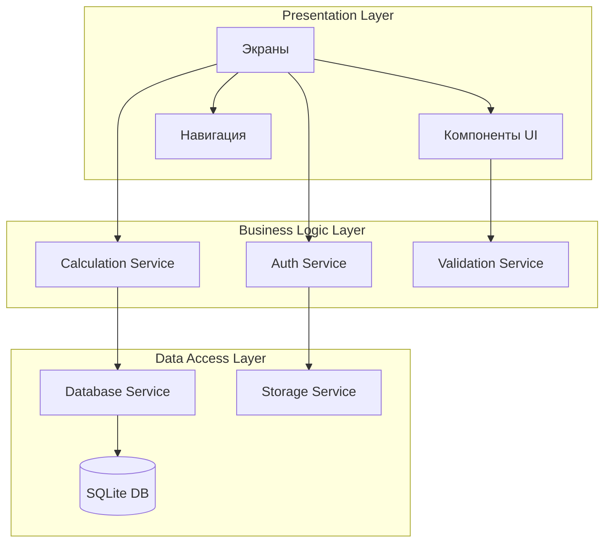
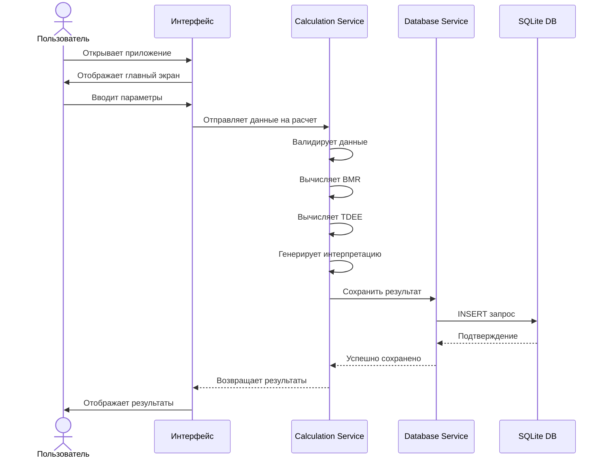
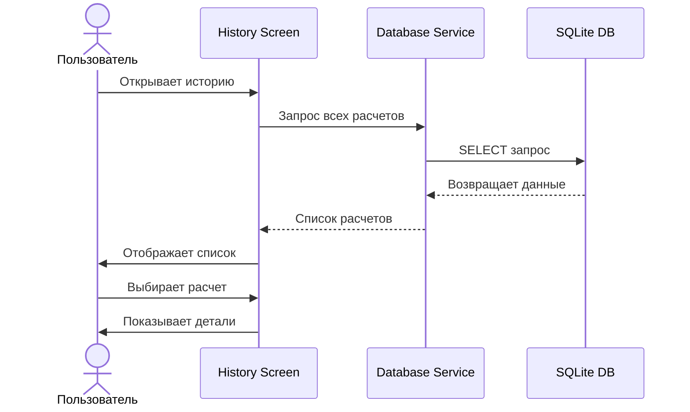
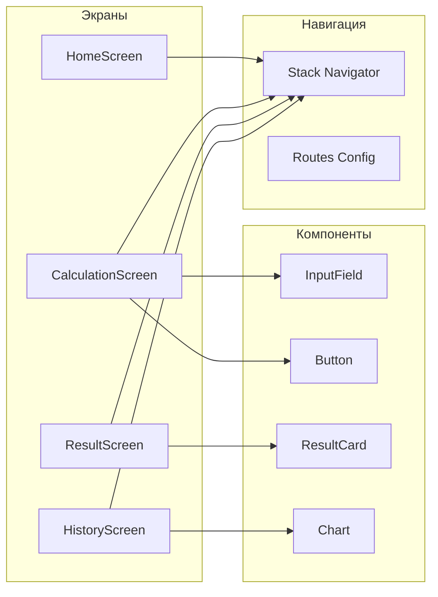
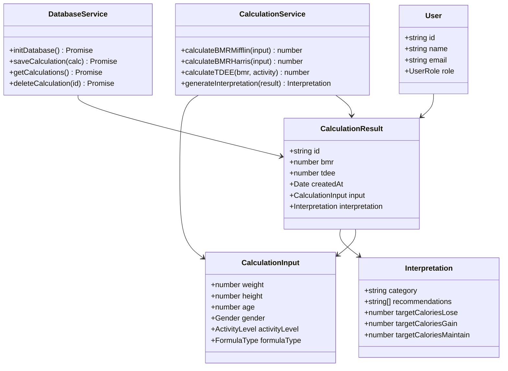
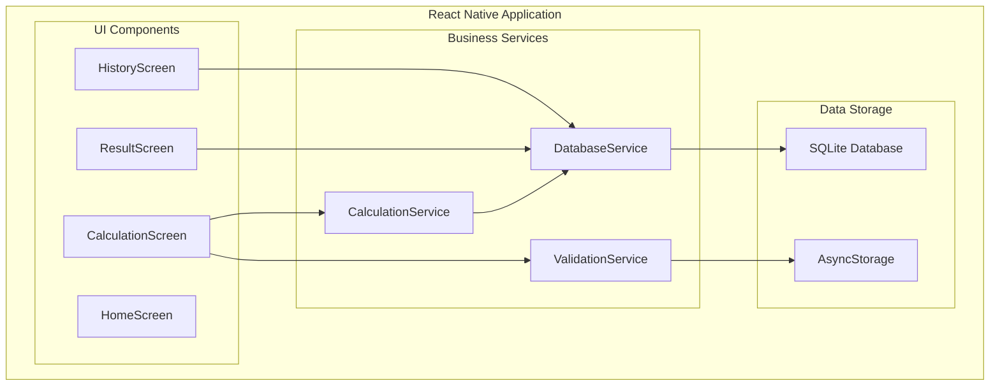
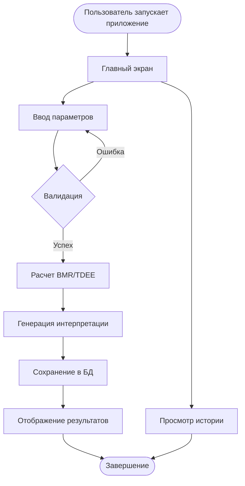

# АРХИТЕКТУРА ПРИЛОЖЕНИЯ
## BMR/TDEE Калькулятор

**Версия:** 1.0  
**Дата:** Январь 2026

---

## 1. ВВЕДЕНИЕ

Данный документ описывает архитектуру мобильного приложения "BMR/TDEE Калькулятор", разработанного на платформе React Native с использованием TypeScript.

### 1.1 Цели архитектуры
- **Модульность** - разделение на независимые компоненты
- **Масштабируемость** - возможность добавления новых функций
- **Тестируемость** - изоляция бизнес-логики от UI
- **Поддерживаемость** - понятная структура кода

---

## 2. ОБЩАЯ АРХИТЕКТУРА СИСТЕМЫ

### 2.1 Трехслойная архитектура

Приложение построено по принципу многослойной архитектуры:



### 2.2 Активные сущности системы

1. **Пользователь (User/Patient)**
   - Взаимодействует с интерфейсом приложения
   - Вводит данные для расчетов
   - Просматривает результаты и историю

2. **Администратор/Врач (Admin/Doctor)** - опционально
   - Имеет доступ к расширенной интерпретации
   - Может просматривать статистику пациентов

3. **База данных SQLite**
   - Хранит историю расчетов
   - Обеспечивает персистентность данных

4. **Сервисы расчетов (Calculation Services)**
   - Выполняют математические вычисления
   - Обрабатывают бизнес-логику

---

## 3. ДЕКОМПОЗИЦИЯ ЗАДАЧИ

### 3.1 Основной сценарий использования



### 3.2 Просмотр истории



---

## 4. АРХИТЕКТУРА СЛОЕВ

### 4.1 Presentation Layer (Слой представления)

**Ответственность:**
- Отображение данных пользователю
- Обработка пользовательского ввода
- Управление навигацией

**Основные компоненты:**



**Структура экранов:**

| Экран | Назначение | Ключевые компоненты |
|-------|-----------|-------------------|
| `HomeScreen` | Главный экран с приветствием и навигацией | Logo, Buttons |
| `CalculationScreen` | Форма ввода параметров | InputFields, Pickers, Buttons |
| `ResultScreen` | Отображение результатов BMR/TDEE | ResultCard, RecommendationsList |
| `HistoryScreen` | Список предыдущих расчетов | FlatList, Charts |

### 4.2 Business Logic Layer (Слой бизнес-логики)

**Ответственность:**
- Выполнение расчетов
- Валидация данных
- Генерация рекомендаций
- Применение бизнес-правил

**Основные сервисы:**

```typescript
// CalculationService - Расчет BMR и TDEE
class CalculationService {
  calculateBMR(params: CalculationInput, formula: FormulaType): number
  calculateTDEE(bmr: number, activityLevel: ActivityLevel): number
  generateInterpretation(result: CalculationResult): Interpretation
}

// ValidationService - Валидация входных данных
class ValidationService {
  validateWeight(weight: number): ValidationResult
  validateHeight(height: number): ValidationResult
  validateAge(age: number): ValidationResult
  validateAllInputs(input: CalculationInput): ValidationResult
}

// AuthService - Простая аутентификация (опционально)
class AuthService {
  getCurrentUser(): User | null
  setCurrentUser(user: User): void
}
```

### 4.3 Data Access Layer (Слой данных)

**Ответственность:**
- Взаимодействие с базой данных
- Хранение и извлечение данных
- Управление локальным хранилищем

**Основные сервисы:**

```typescript
// DatabaseService - Работа с SQLite
class DatabaseService {
  initDatabase(): Promise<void>
  saveCalculation(calculation: Calculation): Promise<number>
  getCalculations(userId?: string): Promise<Calculation[]>
  getCalculationById(id: number): Promise<Calculation>
  deleteCalculation(id: number): Promise<void>
  clearHistory(): Promise<void>
}

// StorageService - Работа с AsyncStorage
class StorageService {
  setItem(key: string, value: string): Promise<void>
  getItem(key: string): Promise<string | null>
  removeItem(key: string): Promise<void>
}
```

---

## 5. UML-ДИАГРАММЫ

### 5.1 Диаграмма классов



### 5.2 Диаграмма компонентов



### 5.3 Диаграмма потоков данных



---

## 6. СТРУКТУРА ПРОЕКТА

```
BMRTDEECalculator/
│
├── android/                    # Android-специфичные файлы
│   ├── app/
│   │   ├── build.gradle
│   │   └── src/main/
│   │       ├── AndroidManifest.xml
│   │       ├── java/com/bmrtdeecalculator/
│   │       └── res/
│   ├── build.gradle
│   └── settings.gradle
│
├── src/                        # Исходный код приложения
│   ├── screens/                # Экраны приложения
│   │   ├── HomeScreen.tsx
│   │   ├── CalculationScreen.tsx
│   │   ├── ResultScreen.tsx
│   │   └── HistoryScreen.tsx
│   │
│   ├── components/             # Переиспользуемые компоненты
│   │   ├── common/
│   │   │   ├── Button.tsx
│   │   │   ├── InputField.tsx
│   │   │   └── Card.tsx
│   │   └── specific/
│   │       ├── ResultCard.tsx
│   │       ├── HistoryItem.tsx
│   │       └── ChartView.tsx
│   │
│   ├── services/               # Бизнес-логика
│   │   ├── CalculationService.ts
│   │   ├── DatabaseService.ts
│   │   ├── ValidationService.ts
│   │   └── AuthService.ts
│   │
│   ├── models/                 # TypeScript типы и интерфейсы
│   │   ├── Calculation.ts
│   │   ├── User.ts
│   │   └── Enums.ts
│   │
│   ├── utils/                  # Вспомогательные функции
│   │   ├── formatters.ts
│   │   ├── constants.ts
│   │   └── helpers.ts
│   │
│   ├── navigation/             # Конфигурация навигации
│   │   ├── AppNavigator.tsx
│   │   └── routes.ts
│   │
│   ├── styles/                 # Глобальные стили
│   │   ├── colors.ts
│   │   ├── typography.ts
│   │   └── common.ts
│   │
│   └── App.tsx                 # Корневой компонент
│
├── docs/                       # Документация
│   ├── TZ.md
│   ├── Architecture.md
│   ├── DataModels.md
│   └── Explanatory_Note.md
│
├── package.json
├── tsconfig.json
├── babel.config.js
├── metro.config.js
└── README.md
```

---

## 7. ПАТТЕРНЫ ПРОЕКТИРОВАНИЯ

### 7.1 Singleton Pattern
**Применение:** DatabaseService  
**Обоснование:** Необходимо единственное подключение к БД

```typescript
class DatabaseService {
  private static instance: DatabaseService;
  
  private constructor() {}
  
  public static getInstance(): DatabaseService {
    if (!DatabaseService.instance) {
      DatabaseService.instance = new DatabaseService();
    }
    return DatabaseService.instance;
  }
}
```

### 7.2 Strategy Pattern
**Применение:** Выбор формулы расчета BMR  
**Обоснование:** Разные алгоритмы расчета (Mifflin vs Harris-Benedict)

```typescript
interface BMRStrategy {
  calculate(input: CalculationInput): number;
}

class MifflinStrategy implements BMRStrategy {
  calculate(input: CalculationInput): number { /* ... */ }
}

class HarrisBenedictStrategy implements BMRStrategy {
  calculate(input: CalculationInput): number { /* ... */ }
}
```

### 7.3 Repository Pattern
**Применение:** DatabaseService  
**Обоснование:** Абстракция работы с данными

```typescript
interface CalculationRepository {
  save(calc: Calculation): Promise<number>;
  findAll(): Promise<Calculation[]>;
  findById(id: number): Promise<Calculation>;
  delete(id: number): Promise<void>;
}
```

---

## 8. УПРАВЛЕНИЕ СОСТОЯНИЕМ

### 8.1 Локальное состояние компонентов
Используется React Hooks (`useState`, `useEffect`) для управления состоянием внутри компонентов.

```typescript
const [weight, setWeight] = useState<number>(70);
const [height, setHeight] = useState<number>(170);
const [age, setAge] = useState<number>(25);
```

### 8.2 Контекст приложения (опционально)
Для глобальных данных (текущий пользователь) используется React Context API.

```typescript
const AppContext = React.createContext<AppContextType>({
  user: null,
  setUser: () => {},
});
```

---

## 9. БЕЗОПАСНОСТЬ

### 9.1 Защита данных
- Локальное хранение без передачи на внешние серверы
- SQLite база данных на устройстве
- Возможность шифрования БД (опционально)

### 9.2 Валидация входных данных
- Проверка диапазонов значений
- Предотвращение SQL-инъекций (использование prepared statements)
- Санитизация пользовательского ввода

---

## 10. ПРОИЗВОДИТЕЛЬНОСТЬ

### 10.1 Оптимизации
- **Мемоизация компонентов** - `React.memo()` для предотвращения лишних рендеров
- **Ленивая загрузка** - отложенная инициализация БД
- **Виртуализация списков** - `FlatList` для истории расчетов
- **Асинхронные операции** - все операции с БД асинхронные

### 10.2 Метрики
- Время запуска: < 3 сек
- Время расчета: < 1 сек
- Время загрузки истории (100 записей): < 2 сек

---

## 11. МАСШТАБИРУЕМОСТЬ

### 11.1 Возможные расширения
- Добавление новых формул расчета (Katch-McArdle, Cunningham)
- Интеграция с фитнес-трекерами
- Синхронизация с облаком
- Расчет макронутриентов (белки, жиры, углеводы)
- Планировщик питания
- Социальные функции (сообщество)

### 11.2 Модульность
Архитектура позволяет легко добавлять новые модули без изменения существующего кода благодаря четкому разделению слоев.

---

## 12. ТЕСТИРОВАНИЕ

### 12.1 Уровни тестирования
- **Unit тесты** - для сервисов расчетов (CalculationService)
- **Integration тесты** - для DatabaseService
- **UI тесты** - для критических сценариев (опционально)

### 12.2 Критические компоненты для тестирования
- CalculationService.calculateBMRMifflin()
- CalculationService.calculateBMRHarris()
- CalculationService.calculateTDEE()
- ValidationService.validateAllInputs()
- DatabaseService.saveCalculation()

---

## 13. РАЗВЕРТЫВАНИЕ

### 13.1 Сборка APK
```bash
cd android
./gradlew assembleRelease
```

Результат: `android/app/build/outputs/apk/release/app-release.apk`

### 13.2 Требования к окружению
- Node.js >= 18
- npm или yarn
- JDK 17
- Android SDK (API 24-35)
- React Native CLI

---

**Дата составления:** 12 января 2026  
**Версия:** 1.0  
**Статус:** Утверждено
