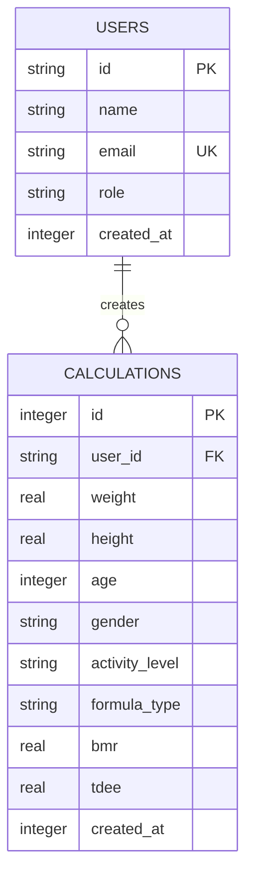
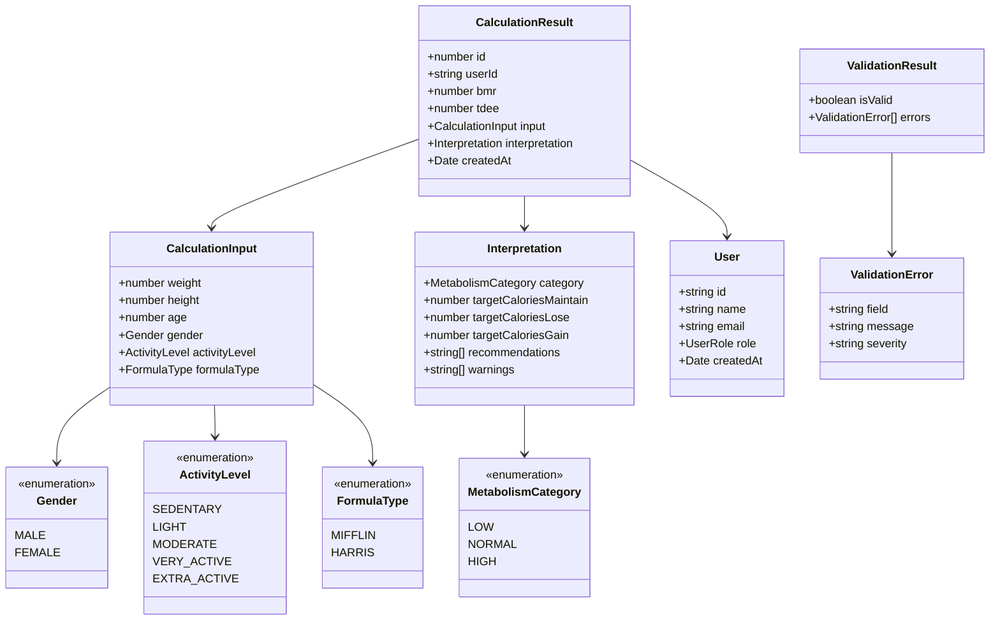

# МОДЕЛИ ДАННЫХ
## BMR/TDEE Калькулятор

**Версия:** 1.0  
**Дата:** Январь 2026

---

## 1. ВВЕДЕНИЕ

Данный документ описывает модели данных, используемые в приложении BMR/TDEE Калькулятор. Включает описание структуры базы данных SQLite, TypeScript интерфейсов и перечислений.

---

## 2. СТРУКТУРА БАЗЫ ДАННЫХ SQLite

### 2.1 Таблица `users` (опционально)

Хранит информацию о пользователях приложения.

| Поле | Тип | Описание | Ограничения |
|------|-----|----------|------------|
| `id` | TEXT | Уникальный идентификатор пользователя | PRIMARY KEY |
| `name` | TEXT | Имя пользователя | NOT NULL |
| `email` | TEXT | Email адрес | UNIQUE |
| `role` | TEXT | Роль пользователя (patient/doctor/admin) | DEFAULT 'patient' |
| `created_at` | INTEGER | Timestamp создания | DEFAULT CURRENT_TIMESTAMP |

**SQL для создания:**
```sql
CREATE TABLE IF NOT EXISTS users (
  id TEXT PRIMARY KEY,
  name TEXT NOT NULL,
  email TEXT UNIQUE,
  role TEXT DEFAULT 'patient',
  created_at INTEGER DEFAULT (strftime('%s','now'))
);
```

### 2.2 Таблица `calculations`

Основная таблица для хранения истории расчетов BMR/TDEE.

| Поле | Тип | Описание | Ограничения |
|------|-----|----------|------------|
| `id` | INTEGER | Уникальный идентификатор расчета | PRIMARY KEY AUTOINCREMENT |
| `user_id` | TEXT | ID пользователя (FK) | |
| `weight` | REAL | Вес в килограммах | NOT NULL |
| `height` | REAL | Рост в сантиметрах | NOT NULL |
| `age` | INTEGER | Возраст в годах | NOT NULL |
| `gender` | TEXT | Пол (male/female) | NOT NULL |
| `activity_level` | TEXT | Уровень активности | NOT NULL |
| `formula_type` | TEXT | Тип формулы (mifflin/harris) | NOT NULL |
| `bmr` | REAL | Расчитанный BMR | NOT NULL |
| `tdee` | REAL | Расчитанный TDEE | NOT NULL |
| `created_at` | INTEGER | Timestamp создания | DEFAULT CURRENT_TIMESTAMP |

**SQL для создания:**
```sql
CREATE TABLE IF NOT EXISTS calculations (
  id INTEGER PRIMARY KEY AUTOINCREMENT,
  user_id TEXT,
  weight REAL NOT NULL,
  height REAL NOT NULL,
  age INTEGER NOT NULL,
  gender TEXT NOT NULL CHECK(gender IN ('male', 'female')),
  activity_level TEXT NOT NULL CHECK(activity_level IN ('sedentary', 'light', 'moderate', 'very_active', 'extra_active')),
  formula_type TEXT NOT NULL CHECK(formula_type IN ('mifflin', 'harris')),
  bmr REAL NOT NULL,
  tdee REAL NOT NULL,
  created_at INTEGER DEFAULT (strftime('%s','now')),
  FOREIGN KEY (user_id) REFERENCES users(id) ON DELETE CASCADE
);

CREATE INDEX IF NOT EXISTS idx_calculations_user_id ON calculations(user_id);
CREATE INDEX IF NOT EXISTS idx_calculations_created_at ON calculations(created_at DESC);
```

### 2.3 Диаграмма ER (Entity-Relationship)



---

## 3. TYPESCRIPT ИНТЕРФЕЙСЫ

### 3.1 Базовые типы и перечисления

**src/models/Enums.ts**

```typescript
// Пол пользователя
export enum Gender {
  MALE = 'male',
  FEMALE = 'female',
}

// Уровень физической активности
export enum ActivityLevel {
  SEDENTARY = 'sedentary',        // 1.2
  LIGHT = 'light',                // 1.375
  MODERATE = 'moderate',          // 1.55
  VERY_ACTIVE = 'very_active',    // 1.725
  EXTRA_ACTIVE = 'extra_active',  // 1.9
}

// Тип формулы расчета BMR
export enum FormulaType {
  MIFFLIN = 'mifflin',
  HARRIS = 'harris',
}

// Роль пользователя
export enum UserRole {
  PATIENT = 'patient',
  DOCTOR = 'doctor',
  ADMIN = 'admin',
}

// Коэффициенты активности
export const ACTIVITY_COEFFICIENTS: Record<ActivityLevel, number> = {
  [ActivityLevel.SEDENTARY]: 1.2,
  [ActivityLevel.LIGHT]: 1.375,
  [ActivityLevel.MODERATE]: 1.55,
  [ActivityLevel.VERY_ACTIVE]: 1.725,
  [ActivityLevel.EXTRA_ACTIVE]: 1.9,
};

// Описания уровней активности
export const ACTIVITY_DESCRIPTIONS: Record<ActivityLevel, string> = {
  [ActivityLevel.SEDENTARY]: 'Минимальная активность, сидячий образ жизни',
  [ActivityLevel.LIGHT]: 'Легкие упражнения 1-3 раза в неделю',
  [ActivityLevel.MODERATE]: 'Умеренные упражнения 3-5 раз в неделю',
  [ActivityLevel.VERY_ACTIVE]: 'Интенсивные тренировки 6-7 раз в неделю',
  [ActivityLevel.EXTRA_ACTIVE]: 'Ежедневные интенсивные тренировки + физическая работа',
};
```

### 3.2 Модель пользователя

**src/models/User.ts**

```typescript
import { UserRole } from './Enums';

export interface User {
  id: string;
  name: string;
  email?: string;
  role: UserRole;
  createdAt: Date;
}

export interface UserDTO {
  id: string;
  name: string;
  email?: string;
  role: string;
  created_at: number;
}

// Преобразование из DTO (БД) в модель
export function userFromDTO(dto: UserDTO): User {
  return {
    id: dto.id,
    name: dto.name,
    email: dto.email,
    role: dto.role as UserRole,
    createdAt: new Date(dto.created_at * 1000),
  };
}

// Преобразование из модели в DTO (БД)
export function userToDTO(user: User): UserDTO {
  return {
    id: user.id,
    name: user.name,
    email: user.email,
    role: user.role,
    created_at: Math.floor(user.createdAt.getTime() / 1000),
  };
}
```

### 3.3 Входные данные для расчета

**src/models/Calculation.ts**

```typescript
import { Gender, ActivityLevel, FormulaType } from './Enums';

// Входные параметры для расчета
export interface CalculationInput {
  weight: number;           // кг (30-300)
  height: number;           // см (100-250)
  age: number;              // лет (18-100)
  gender: Gender;
  activityLevel: ActivityLevel;
  formulaType: FormulaType;
}

// Результат расчета
export interface CalculationResult {
  id?: number;              // ID в БД (если сохранено)
  userId?: string;          // ID пользователя
  bmr: number;              // Базовый метаболизм (ккал/день)
  tdee: number;             // Суточная потребность (ккал/день)
  input: CalculationInput;  // Исходные параметры
  interpretation: Interpretation;
  createdAt: Date;
}

// Интерпретация результатов
export interface Interpretation {
  category: MetabolismCategory;
  targetCaloriesMaintain: number;   // Для поддержания веса
  targetCaloriesLose: number;       // Для снижения веса (-500 ккал)
  targetCaloriesGain: number;       // Для набора веса (+500 ккал)
  recommendations: string[];        // Рекомендации
  warnings: string[];               // Предупреждения
}

// Категория метаболизма
export enum MetabolismCategory {
  LOW = 'low',           // BMR < 1200 (жен) / 1500 (муж)
  NORMAL = 'normal',     // Нормальный диапазон
  HIGH = 'high',         // BMR > 2500 (жен) / 3000 (муж)
}

// DTO для базы данных
export interface CalculationDTO {
  id?: number;
  user_id?: string;
  weight: number;
  height: number;
  age: number;
  gender: string;
  activity_level: string;
  formula_type: string;
  bmr: number;
  tdee: number;
  created_at: number;
}

// Преобразование из DTO в модель
export function calculationFromDTO(dto: CalculationDTO): CalculationResult {
  const input: CalculationInput = {
    weight: dto.weight,
    height: dto.height,
    age: dto.age,
    gender: dto.gender as Gender,
    activityLevel: dto.activity_level as ActivityLevel,
    formulaType: dto.formula_type as FormulaType,
  };

  // Пересоздаем интерпретацию (можно улучшить, сохраняя в БД)
  const interpretation = generateBasicInterpretation(dto.bmr, dto.tdee, input.gender);

  return {
    id: dto.id,
    userId: dto.user_id,
    bmr: dto.bmr,
    tdee: dto.tdee,
    input,
    interpretation,
    createdAt: new Date(dto.created_at * 1000),
  };
}

// Преобразование из модели в DTO
export function calculationToDTO(calc: CalculationResult): CalculationDTO {
  return {
    id: calc.id,
    user_id: calc.userId,
    weight: calc.input.weight,
    height: calc.input.height,
    age: calc.input.age,
    gender: calc.input.gender,
    activity_level: calc.input.activityLevel,
    formula_type: calc.input.formulaType,
    bmr: calc.bmr,
    tdee: calc.tdee,
    created_at: Math.floor(calc.createdAt.getTime() / 1000),
  };
}

// Базовая генерация интерпретации (упрощенная версия)
function generateBasicInterpretation(
  bmr: number,
  tdee: number,
  gender: Gender
): Interpretation {
  const minCalories = gender === Gender.FEMALE ? 1200 : 1500;
  const targetCaloriesLose = Math.max(tdee - 500, minCalories);
  const targetCaloriesGain = tdee + 500;

  let category: MetabolismCategory;
  if (bmr < (gender === Gender.FEMALE ? 1200 : 1500)) {
    category = MetabolismCategory.LOW;
  } else if (bmr > (gender === Gender.FEMALE ? 2500 : 3000)) {
    category = MetabolismCategory.HIGH;
  } else {
    category = MetabolismCategory.NORMAL;
  }

  return {
    category,
    targetCaloriesMaintain: tdee,
    targetCaloriesLose,
    targetCaloriesGain,
    recommendations: [],
    warnings: [],
  };
}
```

### 3.4 Результат валидации

**src/models/Validation.ts**

```typescript
export interface ValidationResult {
  isValid: boolean;
  errors: ValidationError[];
}

export interface ValidationError {
  field: string;
  message: string;
  severity: 'error' | 'warning';
}

export interface InputConstraints {
  weight: { min: number; max: number };
  height: { min: number; max: number };
  age: { min: number; max: number };
}

export const DEFAULT_CONSTRAINTS: InputConstraints = {
  weight: { min: 30, max: 300 },
  height: { min: 100, max: 250 },
  age: { min: 18, max: 100 },
};
```

---

## 4. ПРИМЕРЫ ДАННЫХ

### 4.1 Пример расчета для женщины

```json
{
  "id": 1,
  "userId": "user123",
  "input": {
    "weight": 65,
    "height": 165,
    "age": 30,
    "gender": "female",
    "activityLevel": "moderate",
    "formulaType": "mifflin"
  },
  "bmr": 1405.25,
  "tdee": 2178.14,
  "interpretation": {
    "category": "normal",
    "targetCaloriesMaintain": 2178,
    "targetCaloriesLose": 1678,
    "targetCaloriesGain": 2678,
    "recommendations": [
      "Для поддержания веса потребляйте около 2178 ккал в день",
      "Для снижения веса рекомендуется 1678 ккал в день",
      "Не опускайтесь ниже 1200 ккал в день"
    ],
    "warnings": []
  },
  "createdAt": "2026-01-12T10:30:00Z"
}
```

### 4.2 Пример расчета для мужчины

```json
{
  "id": 2,
  "userId": "user456",
  "input": {
    "weight": 85,
    "height": 180,
    "age": 35,
    "gender": "male",
    "activityLevel": "very_active",
    "formulaType": "harris"
  },
  "bmr": 1912.45,
  "tdee": 3299.98,
  "interpretation": {
    "category": "normal",
    "targetCaloriesMaintain": 3300,
    "targetCaloriesLose": 2800,
    "targetCaloriesGain": 3800,
    "recommendations": [
      "При высоком уровне активности важно получать достаточно калорий",
      "Для поддержания веса потребляйте около 3300 ккал в день",
      "Для набора мышечной массы увеличьте до 3800 ккал"
    ],
    "warnings": []
  },
  "createdAt": "2026-01-12T11:45:00Z"
}
```

---

## 5. ДИАГРАММА КЛАССОВ TypeScript



---

## 6. ИНДЕКСЫ И ОПТИМИЗАЦИЯ

### 6.1 Индексы базы данных

```sql
-- Индекс по user_id для быстрого поиска расчетов пользователя
CREATE INDEX IF NOT EXISTS idx_calculations_user_id 
ON calculations(user_id);

-- Индекс по дате создания для сортировки истории
CREATE INDEX IF NOT EXISTS idx_calculations_created_at 
ON calculations(created_at DESC);

-- Составной индекс для фильтрации
CREATE INDEX IF NOT EXISTS idx_calculations_user_date 
ON calculations(user_id, created_at DESC);
```

### 6.2 Рекомендации по производительности

1. **Пакетная загрузка** - загружать историю порциями (пагинация)
2. **Кэширование** - кэшировать последний расчет в памяти
3. **Ленивая загрузка** - не загружать все данные сразу
4. **Очистка старых данных** - опция удаления расчетов старше N месяцев

---

## 7. МИГРАЦИИ БАЗЫ ДАННЫХ

### 7.1 Версия 1.0 - Начальная схема

```typescript
export const MIGRATION_V1 = `
  CREATE TABLE IF NOT EXISTS users (
    id TEXT PRIMARY KEY,
    name TEXT NOT NULL,
    email TEXT UNIQUE,
    role TEXT DEFAULT 'patient',
    created_at INTEGER DEFAULT (strftime('%s','now'))
  );

  CREATE TABLE IF NOT EXISTS calculations (
    id INTEGER PRIMARY KEY AUTOINCREMENT,
    user_id TEXT,
    weight REAL NOT NULL,
    height REAL NOT NULL,
    age INTEGER NOT NULL,
    gender TEXT NOT NULL CHECK(gender IN ('male', 'female')),
    activity_level TEXT NOT NULL,
    formula_type TEXT NOT NULL,
    bmr REAL NOT NULL,
    tdee REAL NOT NULL,
    created_at INTEGER DEFAULT (strftime('%s','now')),
    FOREIGN KEY (user_id) REFERENCES users(id) ON DELETE CASCADE
  );

  CREATE INDEX idx_calculations_user_id ON calculations(user_id);
  CREATE INDEX idx_calculations_created_at ON calculations(created_at DESC);
`;
```

---

**Дата составления:** 12 января 2026  
**Версия:** 1.0  
**Статус:** Утверждено
